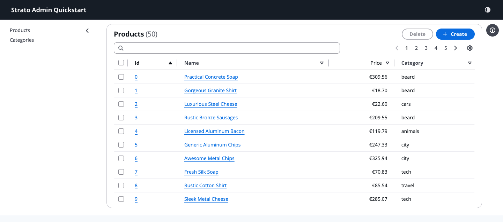
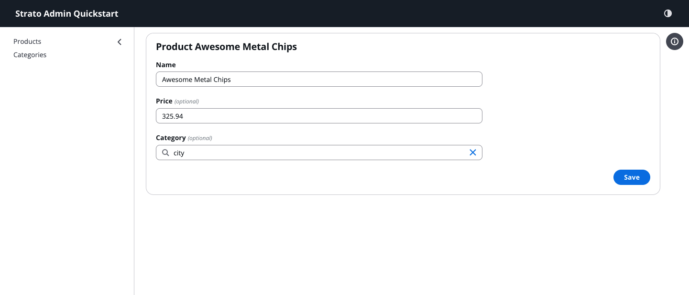
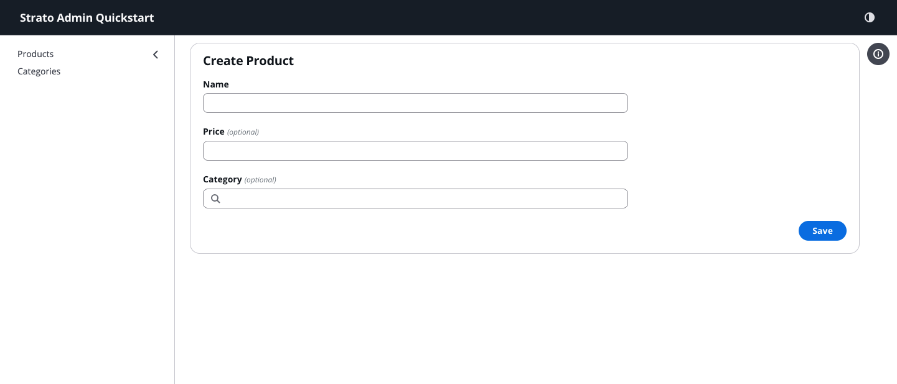

# Strato Admin

WORK IN PROGRESS

A frontend framework for building admin interfaces, built on top of React-Admin
and the Cloudscape Design System. It provides a set of reusable components and
tools to help developers create efficient and user-friendly admin interfaces.

<p align="center">
  
</p>

High-speed development without compromising on versatility.

## Why Strato Admin?

Strato Admin bridges the gap between the speed of "low-code" tools and the flexibility of custom development.

### Schema-First Efficiency

Most admin UIs are repetitive. You define a resource, its fields, and then manually build List, Create, and Edit views for each. Strato Admin's **Schema-First** approach flips this: you define your data model once, and the framework automatically generates standard, high-quality views. This reduces boilerplate by up to 80% while ensuring consistency across your entire application.

### Enterprise-Grade Foundation with Cloudscape

While many admin frameworks rely on general-purpose UI libraries, Strato Admin is built on the [AWS Cloudscape Design System](https://cloudscape.design/). Cloudscape is specifically engineered for complex, data-heavy web applications. It provides:

- **Superior Accessibility**: Built-in WCAG compliance for every component.
- **Complex Data Handling**: Best-in-class tables with column reordering, visibility preferences, and multi-field filtering.
- **Visual Clarity**: A design language optimized for technical users and density without sacrificing usability.

### The Best of React-Admin

By building on top of `ra-core`, Strato Admin inherits a decade of battle-tested logic for data fetching, state management, and authentication. You get the stability of a mature ecosystem with a modern, high-performance UI.

## Installation

```bash
npm install strato-admin
# or
pnpm install strato-admin
```

## Quick Start

```tsx
import React from 'react';
import { Admin, ResourceSchema, TextField, CurrencyField, ReferenceField, IdField } from 'strato-admin';
import { dataProvider } from 'strato-faker-ecommerce';

export const QuickStartApp = () => (
  <Admin dataProvider={dataProvider} title="Strato Admin Quickstart">
    <ResourceSchema name="products">
      <IdField source="id" />
      <TextField source="name" isRequired link="show" />
      <CurrencyField source="price" currency="EUR" />
      <ReferenceField source="category_id" reference="categories" />
    </ResourceSchema>

    <ResourceSchema name="categories">
      <IdField source="id" />
      <TextField source="name" link="show" isRequired />
    </ResourceSchema>
  </Admin>
);
```

| List Page                                                                          | Details Page                                                                          |
| :--------------------------------------------------------------------------------- | :------------------------------------------------------------------------------------ |
|  |  |

| Edit Page                                                                          | Create Page                                                                            |
| :--------------------------------------------------------------------------------- | :------------------------------------------------------------------------------------- |
|  |  |

## Features

### Development Velocity

- **Schema-First Architecture (In development)**: Define your data model once and let components automatically render the UI.
- **Declarative View-Based UI**: Standard React-Admin style components for granular control.
- **Backend Agnostic**: Connect to any backend using the extensive ecosystem of React-Admin data providers.

### Enterprise-Grade Quality

- **Accessibility-First Design**: Leverages AWS Cloudscape's WCAG-compliant components.
- **Internationalization**: Using ICU MessageFormat for robust multilingual support.
- **TypeScript Foundation**: Built with TypeScript for a predictable developer experience.

### Architectural Versatility

- **Headless Integration Hooks (In development)**: Low-level hooks for building bespoke interfaces while preserving state logic.
- **Cloudscape Theme**: A modern UI for React-Admin powered by the Cloudscape Design System.

## Monorepo Structure

Strato Admin is organized as a monorepo with the following packages:

### Core Packages

- **`strato-admin`**: The main entry point that combines core logic with the Cloudscape UI.
- **`strato-cloudscape`**: UI component library and theme implementation using AWS Cloudscape Design System.
- **`strato-core`**: Core framework logic, schema definitions, and headless hooks.
- **`ra-core`**: A vendored version of React-Admin core.

### Internationalization

- **`strato-i18n`**: ICU MessageFormat-based i18n provider for React-Admin.
- **`strato-i18n-cli`**: Tooling for extracting and compiling translations.
- **`strato-language-en` / `fr`**: Standard translation packages for English and French.

### Utilities & Tools

- **`strato-faker-ecommerce`**: Mock data generator for e-commerce domains, used for demos and testing.

## Documentation

The documentation is built with Docusaurus. To start it locally:

```bash
pnpm run docs:dev
```

## UI Components Library (Storybook)

We use Storybook to develop and showcase our UI components in isolation.

```bash
pnpm run storybook
```

To update the static screenshots used in the documentation:

```bash
cd packages/strato-cloudscape && npx playwright test e2e/screenshots.spec.ts
```

## Architectural Approaches

Strato Admin supports three primary development styles:

1.  **Schema-First**: Define a central data model and let components automatically render the UI. Best for maximum speed.
2.  **View-Based (React-Admin style)**: Explicitly define views using declarative themed components. Best for standard CRUD with granular control.
3.  **Headless Integration**: Use low-level hooks like `useCollection` with raw Cloudscape components. Best for highly custom layouts.

See the [Architectural Approaches documentation](https://github.com/vlad-strato/strato-admin/blob/main/docs/docs/architecture.md) for more details.

## Examples

Check out the [demo example](./examples/demo) for a more comprehensive showcase of features including:

- Complex data types (Dates, Booleans, Numbers)
- Reference fields and relationships
- Detail views (Show)
- Selection and bulk actions
- Column reordering and visibility preferences
