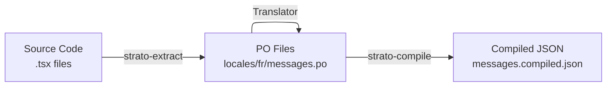

# Internationalization (i18n)

Strato Admin uses the **"Source as Key"** approach to i18n: you write labels in English directly in your component props, and the framework automatically extracts, tracks, and compiles those strings for translation.

## How it works

Instead of inventing translation keys, the English text itself is the key:

```tsx
// ❌ Traditional approach
<TextField source="name" label="resources.products.fields.name" />

// ✅ Strato Admin approach
<TextField source="name" label="Product Name" />
```

This works well for admin apps for a few practical reasons:

**No key maintenance.** With traditional key-based i18n, every new field requires updating a translation file just to register the key. Here, writing `label="Warehouse Location"` is enough — the string is picked up automatically.

**Labels stay close to the code.** Field labels sit right next to the field definition, so it's easy to see what will appear in the UI without opening a separate file.

**Easy to add later.** Many admin tools start English-only and add translations down the road. You can drop in an `i18nProvider` at any point — the labels you already wrote become the translation source automatically.

At runtime, `icuI18nProvider` hashes each English string into a short stable ID (e.g., `"Product Name"` → `1kdfstp`) and uses it to look up the translation.

:::info Technical detail
The hash function used to generate stable IDs from source strings is a non-cryptographic algorithm called **FNV-1a**. Contrary to cryptographic hashes, like SHA, FNV-1a is designed for speed and simplicity, making it ideal for runtime use in the browser without any performance impact.
:::

:::note Contrast with formatjs
[FormatJS](https://formatjs.io/) takes a different approach: a Babel/SWC plugin rewrites your source code at compile time, replacing string literals with their pre-computed hash IDs before the bundle is built. This means zero runtime hashing cost, but requires a build-time transform step. Strato Admin avoids the build plugin entirely — the same `generateMessageId` function runs in the CLI (during extract/compile) and in the browser (during lookup), keeping the pipeline simple and framework-agnostic.
:::

Before hashing, the string is **normalized**: all whitespace sequences (spaces, newlines, tabs) are collapsed to a single space and the result is trimmed. This means reformatting a label in your source — wrapping a long string across lines, changing indentation — never changes its hash or invalidates existing translations:

```tsx
// All three produce the same hash
label="Edit Product - {name}"
label="  Edit Product   -   {name}"
label={`
  Edit Product - {name}
`}
```

## The Three-Step Workflow



### Step 1 — Extract

Run `strato-extract` to scan your source files and generate `.po` translation files. It looks for translatable props (`label`, `title`, `description`, `placeholder`, `emptyText`, and more) on Strato components.

```bash
strato-extract --format=po "src/**/*.{ts,tsx}" "locales/*/messages.po"
```

This creates or updates one `.po` file per locale directory. If the file already exists, new strings are appended and existing translations are preserved.

**Add the script to `package.json`:**

```json
{
  "scripts": {
    "i18n:extract": "strato-extract --format=po \"src/**/*.{ts,tsx}\" \"locales/*/messages.po\"",
    "i18n:compile": "strato-compile \"locales/*/messages.po\""
  }
}
```

**Locale directory layout:**

```
locales/
  en/
    messages.po           ← human-editable translations
    messages.compiled.json  ← generated by compile step
  fr/
    messages.po
    messages.compiled.json
```

### Step 2 — Translate

Open the `.po` files and fill in the `msgstr` for each `msgid`. The `#. id:` comment is the stable hash — don't change it.

**`locales/fr/messages.po`** (excerpt from the demo):

```po
#: src/resources/products.tsx:29
#. id: 1kdfstp
msgid "Products"
msgstr "Produits"

#: src/resources/products.tsx:32
#. id: 10kmuai
msgid "Edit Product - {name}"
msgstr "Modifier le produit - {name}"

#: src/resources/products.tsx:43
#. id: 1pdyg96
msgid "Price"
msgstr "Prix"

#: src/resources/reviews.tsx:27
#. id: i9emhs
msgid "Accepted"
msgstr "Accepté"
```

:::caution Not classical Gettext
These `.po` files use the file structure of Gettext but the **message format is ICU**, not Gettext. This has two important consequences:

- **Pluralization** uses ICU syntax inside the `msgid`/`msgstr` (e.g., `{count, plural, one {# item} other {# items}}`), not Gettext's separate `msgid_plural` / `msgstr[0]` / `msgstr[1]` fields.
- **Interpolation** uses `{variable}` placeholders, not `%s` or `%1$s`.

Standard Gettext tools like Poedit can open these files, but their plural helpers won't apply — plurals must be written as a single ICU string in `msgstr`. Cloud translation platforms (Transifex, Crowdin) generally support ICU format and will handle this correctly when configured for ICU messages.
:::

### Step 3 — Compile

Convert the `.po` files into compact JSON bundles for the browser:

```bash
pnpm i18n:compile
```

Each `messages.compiled.json` contains only `hash → translation` pairs:

```json
{
  "10kmuai": "Modifier le produit - {name}",
  "1kdfstp": "Produits",
  "1pdyg96": "Prix"
}
```

Untranslated strings fall back to the English `msgid` automatically.

## Wiring It Up in Your App

Use `icuI18nProvider` from `@strato-admin/i18n` and pass it to `<Admin>`.

```tsx
import { Admin } from '@strato-admin/admin';
import { icuI18nProvider } from '@strato-admin/i18n';

// Built-in framework messages (buttons, validation errors, etc.)
import englishMessages from '@strato-admin/language-en';
import frenchMessages from '@strato-admin/language-fr';

// Your app's compiled translations
import enAppMessages from '../locales/en/messages.compiled.json';
import frAppMessages from '../locales/fr/messages.compiled.json';

const messages = {
  en: { ...englishMessages, ...enAppMessages },
  fr: { ...frenchMessages, ...frAppMessages },
};

const i18nProvider = icuI18nProvider(
  (locale) => messages[locale as keyof typeof messages],
  'en', // default locale
  [
    { locale: 'en', name: 'English' },
    { locale: 'fr', name: 'Français' },
  ],
);

export default function App() {
  return (
    <Admin dataProvider={dataProvider} i18nProvider={i18nProvider}>
      {/* your resources */}
    </Admin>
  );
}
```

The `icuI18nProvider` handles locale switching, ICU message formatting, and fallbacks automatically. Spreading `englishMessages` first ensures the framework's built-in strings (like form validation errors and button labels) are covered even if your app messages don't include them.

## ICU Message Format

Strato Admin uses the [ICU Message Format](https://unicode-org.github.io/icu/userguide/format_parse/messages/) for interpolation and pluralization.

**Interpolation** — reference record fields by name:

```tsx
<ResourceSchema name="products" editTitle="Edit Product - {name}" />
```

In French: `"Modifier le produit - {name}"` — the `{name}` placeholder is substituted at runtime.

**Pluralization:**

```tsx
<TextField label="{count, plural, =0 {No items} one {One item} other {# items}}" />
```

## What Gets Extracted

The extractor scans these props on Strato components:

| Category     | Props                                                                                         |
| ------------ | --------------------------------------------------------------------------------------------- |
| Labels       | `label`, `listLabel`, `createLabel`, `editLabel`, `detailLabel`                               |
| Titles       | `title`, `listTitle`, `createTitle`, `editTitle`, `detailTitle`                               |
| Descriptions | `description`, `listDescription`, `createDescription`, `editDescription`, `detailDescription` |
| Form         | `placeholder`, `emptyText`, `helperText`, `constraintText`, `saveButtonLabel`                 |
| Feedback     | `successMessage`, `errorMessage`                                                              |

## Customizing the Extractor

Add a `strato-i18n.config.json` to your project root to include custom components or props:

```json
{
  "components": ["MyCustomButton", "HeroSection"],
  "translatableProps": ["ctaText", "subheading"]
}
```

The defaults are merged with your additions — you don't need to re-list built-in components.
