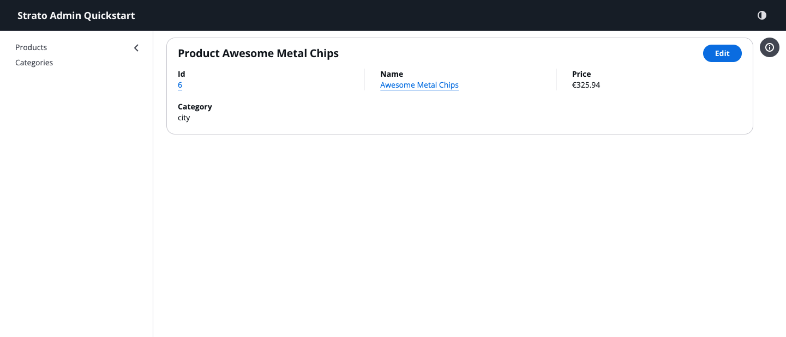

# Introduction

Strato Admin is a React-based framework for building administrative interfaces.
It integrates [React-Admin](https://marmelab.com/react-admin/) core logic with
the [AWS Cloudscape Design System](https://cloudscape.design/) to provide a set
of components optimized for data-dense, accessible, and consistent back-office
applications.


## Overview

Enterprise admin tools often face a trade-off: either use a fast-to-develop CRUD
framework that can feel too generic for users, or build a custom UI from scratch
at a much higher development and maintenance cost.

Strato Admin provides a schema-first workflow that generates standardized views
out-of-the-box, while retaining the flexibility to drop down to view-based
approaches or headless hooks for more complex, custom requirements.

## Installation

The easiest way to start a new project is using our scaffolding tool:

```bash
pnpm create @strato-admin
```

This will create a new project pre-configured with Vite, React 19, and the Cloudscape Design System.

Alternatively, you can add it to an existing project:

```bash
pnpm add @strato-admin/admin
```

## Quick Start

```tsx
import React from 'react';
import { Admin, ResourceSchema, TextField, CurrencyField, ReferenceField, IdField } from '@strato-admin/admin';
import { dataProvider } from '@strato-admin/faker-ecommerce';

export const QuickStartApp = () => (
  <Admin dataProvider={dataProvider} title="Strato Admin Quickstart">
    <ResourceSchema name="products">
      <IdField source="id" />
      <TextField source="name" isRequired link="show" />
      <CurrencyField source="price" currency="EUR" />
      <ReferenceField source="category_id" reference="categories" />
    </ResourceSchema>

    <ResourceSchema name="categories">
      <IdField source="id" />
      <TextField source="name" link="show" isRequired />
    </ResourceSchema>
  </Admin>
);
```

| List Page                                                   | Details Page                                               |
| :---------------------------------------------------------- | :--------------------------------------------------------- |
|      |  |
| **Create Page**                                             | **Edit Page**                                              |
|  |     |

## Core Concepts

### Schema-Driven UI Generation

The framework allows you to define a central data model (schema) for your
resources. Standard List, Create, Edit, and Detail views are automatically
generated from this schema, ensuring consistency across the application and
reducing the manual implementation of repetitive UI patterns.

### Built on Cloudscape Design System

Unlike general-purpose UI libraries, Cloudscape is specifically designed for
complex, technical applications. By using Cloudscape, Strato Admin inherits:

- **Built-in Accessibility**: All components are designed for high accessibility standards.
- **Data-Dense Layouts**: UI patterns optimized for information density and technical workflows.
- **Advanced Data Tables**: Support for multi-field filtering, column reordering, and user preferences out of the box.

### React-Admin Core Integration

Strato Admin currently integrates a **vendored** version of React-Admin core
(`@strato-admin/ra-core`). This approach involves maintaining the dependency's
source code directly within the project, which provides several technical
advantages:

- **Custom Patching**: Direct access to the core logic allows for immediate bug fixes and the application of patches specific to the framework's requirements.
- **Deep Integration**: It enables tighter coupling between React-Admin's state management and the Cloudscape Design System's complex UI patterns.
- **Dependency Stability**: The framework is insulated from upstream breaking changes, ensuring a predictable development and release cycle.

## Architectural Approaches

Strato Admin supports three primary development styles depending on the required level of control:

1.  **Schema-First**: High-level resource definitions for rapid prototyping and standardized CRUD.
2.  **Themed Components**: Explicit view definitions using declarative components.
3.  **Headless Integration**: Direct use of framework hooks with custom UI components.

See the [Architectural documentation](../core-concepts/architecture.md) for more details.

## Next Steps

- **[Quick Start](./quick-start.md)**: Build your first Strato Admin app in 5 minutes.
- **[Architectural Approaches](../core-concepts/architecture.md)**: Learn about Schema-First, View-Based, and Headless patterns.
- **[Field to Input Mapping](../reference/inputs/inputs.md)**: Understand how fields are converted to form inputs.
- **[Fields Reference](../core-concepts/fields.md)**: Explore the data display components.
